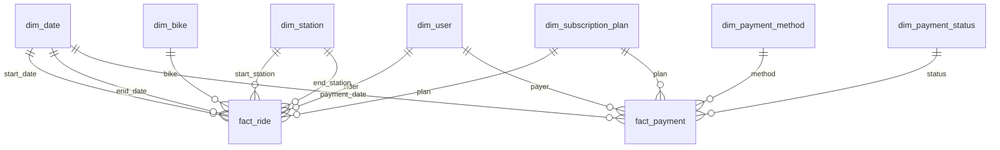

# 🚲 Bike-Sharing Data Warehouse

An end-to-end analytics project for a bike-sharing service: a **Django (PostgreSQL) operational app** as the data source, modelled into a **dimensional data warehouse (star schema)** on Supabase, with a set of **analytical SQL queries** that answer real business questions (demand peaks, station rebalancing, revenue by plan, payment health).

> Built as a university team project for the *Management for Digital Enterprise* course. This repository contains the operational Django app **and** the warehouse layer (schema + analytical queries) that the app's data is transformed into.

---

## Why this project

A transactional (OLTP) database is built for *recording* rides and payments, not for *analysing* them. Analytical questions like "when is demand highest?" or "which stations need rebalancing?" are slow and awkward against a normalised operational schema. The solution is a **dimensional model**: conformed dimensions + fact tables at a clear grain, optimised for aggregation.

This project shows the full path: **operational schema → dimensional warehouse → business insight.**

---

## Architecture

```
┌──────────────────────────┐        ETL         ┌────────────────────────────┐
│  OLTP  (schema: public)  │  ───────────────▶  │   DWH  (schema: dwh)        │
│  Django `core_*` tables  │   transform &      │   star schema               │
│  users, bikes, stations, │   load into        │   7 dimensions + 2 facts    │
│  rides, payments, subs   │   conformed dims    │   (surrogate keys)          │
└──────────────────────────┘                    └────────────────────────────┘
            │                                                  │
   built for transactions                          built for analytical queries
```

### Star schema



- **`fact_ride`** — grain: one row per ride (8,000 rows). Measures: distance, duration, battery start/end.
- **`fact_payment`** — grain: one row per payment (6,473 rows). Measure: amount.
- **Dimensions** — `dim_date` (1,461 days / 4 years), `dim_user`, `dim_bike`, `dim_station`, `dim_subscription_plan`, `dim_payment_method`, `dim_payment_status`. All facts join via **surrogate keys**; natural keys are kept for traceability back to the OLTP source.

Full DDL: [`warehouse/01_star_schema.sql`](warehouse/01_star_schema.sql).

---

## Example insights

A few of the queries in [`warehouse/02_analytical_queries.sql`](warehouse/02_analytical_queries.sql), run on the dataset:

**Weekday vs weekend usage**

| day_type | rides | avg_minutes |
|----------|------:|------------:|
| Weekday  | 5,846 | 21.3 |
| Weekend  | 2,154 | 21.4 |

**Payment health**

| status  | payments | total amount |
|---------|---------:|-------------:|
| paid    | 5,594 | 39,592.71 |
| pending |   587 |  7,781.67 |
| failed  |   292 |  1,619.04 |

Other queries cover hourly demand peaks, busiest stations, revenue by subscription plan, the monthly ride trend (via the date dimension), and **net flow per station** (arrivals − departures) to flag rebalancing needs.

---

## Tech stack

- **PostgreSQL** (hosted on **Supabase**) — warehouse engine
- **SQL** — dimensional DDL + analytical queries (joins, CTEs, window-style aggregation)
- **Django ORM / Python** — operational application and source schema
- **Dimensional modelling** — star schema, surrogate keys, conformed dimensions, fact grain

---

## Repository structure

```
.
├── warehouse/
│   ├── 01_star_schema.sql        # CREATE SCHEMA + dimension & fact tables
│   └── 02_analytical_queries.sql # business questions answered in SQL
├── core/                         # Django app: operational models (OLTP source)
├── DjangoProject/                # Django project settings
├── manage.py
└── README.md
```

---

## Running it

```bash
# 1. Apply the warehouse schema to any PostgreSQL / Supabase database
psql "$DATABASE_URL" -f warehouse/01_star_schema.sql

# 2. (After loading data from the operational tables) run the analyses
psql "$DATABASE_URL" -f warehouse/02_analytical_queries.sql
```

The operational Django app can be run with the usual `python manage.py migrate && python manage.py runserver`.

---

## Notes

- The dataset is **seeded / synthetic** (generated for the course), so the figures above demonstrate the *modelling and query capability*, not real-world ridership.
- Team project — operational app and warehouse built collaboratively (contributors: **dhiatnit**, **madushani9-N**).
